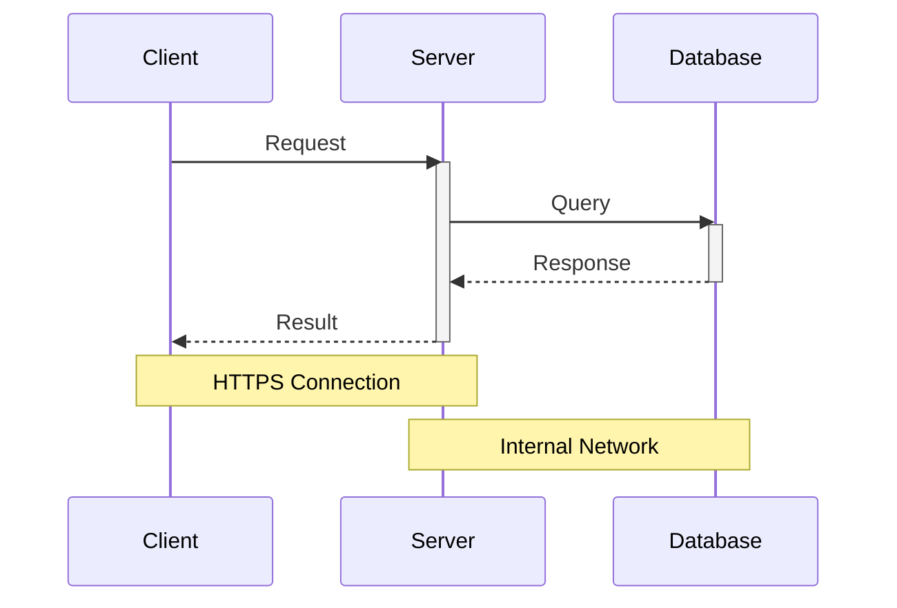

# Mermaid Diagram Templates

Use this reference when Mira needs quick, editable diagram code for a Chinese
mathematical modeling paper. Mermaid is best as a structure-first draft or a
simple final diagram when the layout remains readable after export.

## Sequence Diagram

Use `sequenceDiagram` when the claim depends on interaction order:

- data pipeline interaction: loader -> validator -> model -> result store;
- solver call chain: paper code -> solver -> data file -> audit result;
- simulation feedback: controller -> system -> observation -> correction;
- multi-agent or multi-role collaboration;
- experiment workflow: configuration -> solver -> validation -> frozen result.

Do not use a sequence diagram for a static model structure, a formula chain, or
a one-step calculation. Use a flowchart, structure diagram, or table instead.

Reusable template:

```text
assets/templates/mermaid_sequence_diagram.mmd
```

Base pattern:



## Paper Rule

Keep participant names short and Chinese when used in a Chinese paper. Use
`activate/deactivate` only when the active period matters. Use `alt/else/end`
only for real branches. Add notes only when they explain a boundary, channel,
assumption, or evidence path.

For important contest-final figures, Mermaid can be the first draft. If the
figure is central to the paper's visual quality, export or redraw it as SVG,
PPT, or TikZ and keep the Mermaid source in `diagrams/`.
